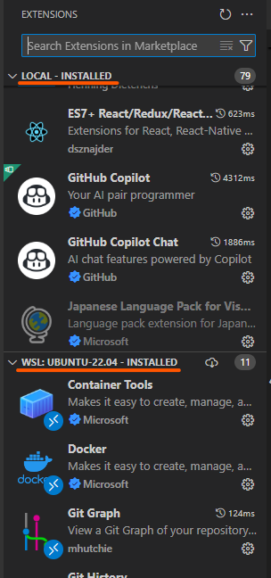

## 概要

VSCodeをWSLに接続し、GitHub Copilot Agentを利用した際に「パスの問題がある」と表示され、ファイルの読み書きができない事象に遭遇しました。本記事では、その原因と対処法を解説します。

## 環境

- Windows 11
- WSL2
- VSCode 1.101.2
  - GitHub Copilot Chat 0.28.5
  - WSL 0.99.0

## 問題の内容

GitHub Copilot Agentにファイルの読み書きが必要な指示をすると、「ファイルが読み取れない」などのエラーが返され、作業が進まない場合があります。（「パスの問題がある」というメッセージが表示されることもありますが、今回は再現できませんでした）


VSCodeの出力ログでGitHub Copilot Chatのログを確認すると、以下のようなエラーが出力されていました。

```
2025-07-17 08:47:46.602 [error] Error from tool list_dir with args {"path":"\\home\\[省略]\\code\\cpp-sandbox"}: Directory \home\[省略]\code\cpp-sandbox is outside of the workspace and can't be read: Error: Directory \home\[省略]\code\cpp-sandbox is outside of the workspace and can't be read
    at sJ.invoke (c:\Users\[省略]\.vscode\extensions\github.copilot-chat-0.28.5\dist\extension.js:1407:7376)
    at Jq.$invokeTool (file:///c:/Users/[省略]/AppData/Local/Programs/Microsoft%20VS%20Code/resources/app/out/vs/workbench/api/node/extensionHostProcess.js:153:2728)
```

## 対処法

`settings.json`で以下の設定をしている場合は、削除すると正常に動作します。

```json
  "remote.extensionKind": {
    "GitHub.copilot": [
      "ui"
    ],
    "GitHub.copilot-chat": [
      "ui"
    ]
  }
```

## 解説

VSCodeをリモート（WSL）に接続して使用する場合、拡張機能は「リモート（WSL）側」と「Windows側」に分かれてインストールされます。通常、GitHubやGitHub Copilotの拡張機能は「リモート（WSL）側」にインストールされますが、上記設定をしていると「Windows側」にインストールされます。



↑この画面ではGitHub Copilot Chatが「Windows側」にインストールされています。

この設定は、例えばリモート接続先がインターネットに接続できない場合などに有効ですが、今回のようなケースではパスの扱いに問題が生じ、GitHub Copilot Agentがファイルを正しく操作できなくなります。
